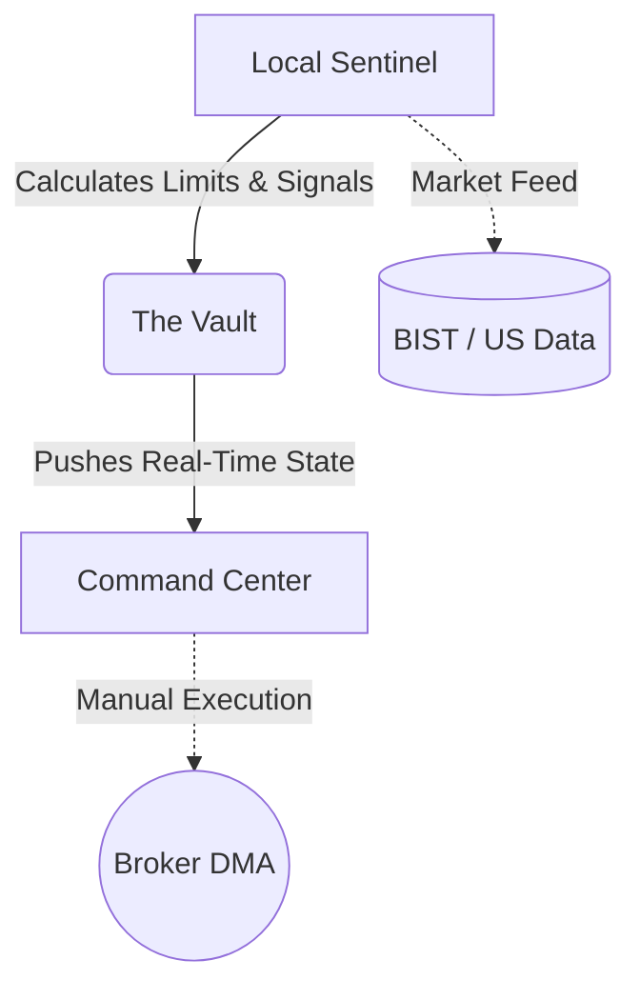
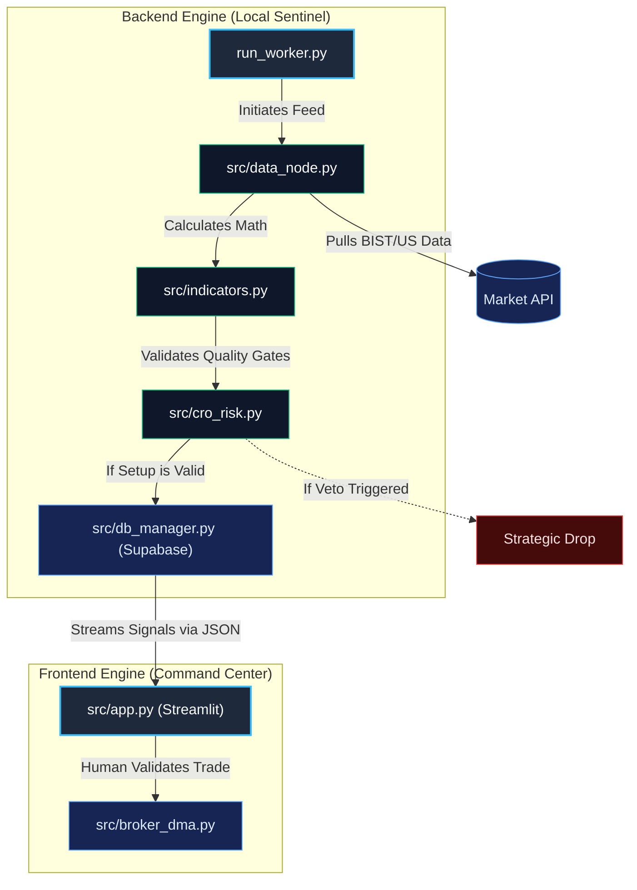

<div align="center">
 
# SOVEREIGN NODE
### Bi-Modal Quantitative Trading & Command Center

[](https://www.python.org/downloads/release/python-3100/)
[](https://streamlit.io)
[](https://postgresql.org)
[]()
[](https://opensource.org/licenses/MIT)

*A professional-grade, zero-latency trading command center tailored for Borsa Istanbul (BIST) and US Markets. Designed to balance Core Wealth Protection with Aggressive Momentum Trading.*

</div>

---

## Executive Summary & Investment Thesis

The Sovereign Node is built on institutional principles to scale capital efficiently, avoiding the pitfalls of high-frequency retail black-box APIs that bleed capital to slippage. 

It operates as a highly advanced **Decision Support System (A "Bloomberg Panel")**. It empowers human execution with institutional-grade math, dynamic regime filters, and statistical arbitrage indicators, ensuring maximum survivability during bear markets and compounded growth during bull cycles.

---

## System Architecture

The Sovereign Node employs a strictly decoupled architecture to prevent exchange-side WAF bans and maintain absolute data sovereignty.



### Algorithmic Execution Flow (Script Interactions)

This pipeline maps exactly how the core python scripts interact to protect capital. The decoupling ensures the front-end dashboard remains hyper-responsive while the heavy quantitative lifting happens completely asynchronously.



- **The Local Sentinel (`worker.py`)**: A backend daemon running locally. It pulls market data, processes math filters, and pushes execution limits to the cloud.
- **The Vault (Supabase)**: A PostgreSQL cloud database securely holding calculated limits, acting as the bridge between your workstation and mobile device.
- **The Command Center (`app.py`)**: A Streamlit web application optimized for mobile triage, allowing the operator to execute safely via their broker on the go.

---

## Quantitative Logic & Quality Gates

The engine actively filters out dangerous market conditions before a trade is ever displayed.

### Bi-Modal Portfolio Distribution
- **THE TANK (Core 70%)**: High-liquidity "Blue Chip" stocks. Entry triggers on an `SMA(20) - 0.5 * ATR(14)` pullback.
- **THE SNIPER (Satellite 30%)**: High-volatility growth stocks. Entry triggers on a deeper `SMA(20) - 1.0 * ATR(14)` pullback.

### Institutional Quality Gates
| Gate | Description |
| :--- | :--- |
| **SMA(200) Check** | Stocks trading below their 200-day moving average are automatically rejected to prevent "bottom-fishing". |
| **Regime Filter** | Overall market (BIST-100 / SPY) measured against SMA(50). Position sizes halve during "BEAR" regimes. |
| **ADX Trend** | Stocks with ADX < 20 are rejected to prevent mean-reversion shredding in choppy sideways markets. |
| **ADV Impact Cap** | Position sizes are capped at 1% of Average Daily Value (ADV) to avoid spread slippage. |

---

## Quick Start Guide

### 1. Environment Preparation
Ensure you have Python 3.10+ installed.
```bash
git clone https://github.com/ragzur123-pixel/tradepanel.git
cd tradepanel
pip install -r requirements.txt
```

### 2. Database Initialization
1. Create a free project at [Supabase](https://supabase.com).
2. Go to the SQL Editor and run `geminidocs/schema.sql` to generate the tables.
3. Run `geminidocs/seed_data.sql` to populate your initial CORE and SATELLITE watchlists.

### 3. Environment Configuration
Create a `.env` file in the root directory:
```env
SUPABASE_URL="your-project-url"
SUPABASE_KEY="your-service-role-secret-key"
```

### 4. Running the Node
Launch the Local Sentinel (Preferably via Task Scheduler):
```bash
python run_worker.py
```
Launch the Mobile Command Center:
```bash
streamlit run src/app.py
```

---

## Operational Rules (The Sovereign Operator)

1. **Tick Accuracy**: All limits are pre-rounded to valid exchange tick sizes. Use the "COPY PRICE" button.
2. **Conditional Orders**: Bypass human latency by setting Broker Conditional Orders the night before.
3. **KAP Check Mandatory**: Always verify the Public Disclosure Platform (KAP) before executing an intraday alert.
4. **No Idle Cash**: Uninvested portfolio capital must be parked in Money Market Funds (PPF).
5. **The Sentinel Rule**: If the Streamlit UI displays a Red "SYSTEM STALE" warning, **DO NOT TRADE**.

<div align="center">
 <br>
 <i>Built with precision for Borsa Istanbul and US Markets.</i>
</div>
